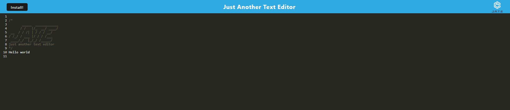

##JATE, Just Another Text Editor

## Description

This application allows users to create notes or code snippets regardless of having an internet connection. This application runs in the browser as well as having a progressive web app installation feature and can function on or offline.

## Table of Contents

1. [Installation](#installation)
2. [Usage](#usage)
3. [Credits](#usage)
4. [Licensing](#licensing)
5. [Tests](#test)
6. [Questions](#questions)

## Installation

The GitHub Repository can be found here: https://github.com/mbottoms3/Text_Editor_App

## Usage

NA

## Credits

There were no collaborators on this project

## Licensing

This project uses the MIT license.

## Tests

NA

## Questions

If there are any questions please reach out to me at bottoms.micah.3@gmail.com

Github profile: [mbottoms3](https://github.com/mbottoms3)

